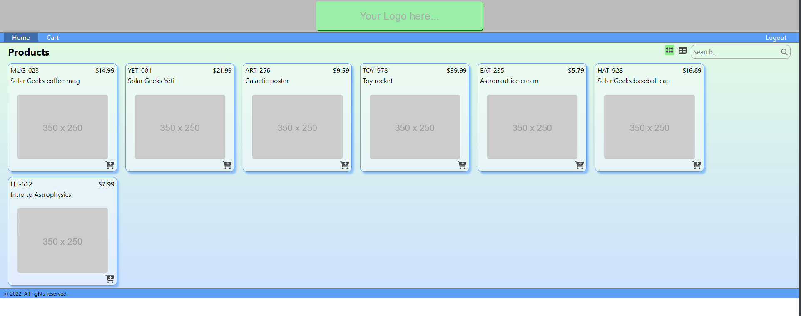

# Ramazon: Your All-in-One Online Shopping Experience

## Table of Contents
1. [About The Project](#about-the-project)
2. [Tech Stack](#tech-stack)
3. [Features](#features)
4. [Use Cases](#use-cases)
5. [API Endpoints](#api-endpoints)
6. [Bonus Features](#bonus-features)
7. [UI Layout](#ui-layout)
8. [Getting Started](#getting-started)

## About The Project

Ramazon is an e-commerce application designed to showcase a myriad of software engineering practices and technologies, including but not limited to:

- Data Access Object (DAO) Pattern
- REST API consumption and creation
- Secure authentication
- Creating HTML and use of semantic elements
- CSS styling and layout with grid and flexbox
- DOM manipulation
- Event handling and listeners
- Using Vue Router to create a single-page application (SPA)
- Vue.js frontend (Vue2 & Vue3)

The project aims to simulate a real-world online shopping experience, where users can view products, add them to carts or wishlists, and proceed to checkout.

## Tech Stack

- **Backend**: Java (Spring Boot)
- **Frontend**: Vue.js (Vue2 & Vue3)
- **Database**: SQL
- **Authentication**: Custom Auth for API access

## Features

### Backend
1. **DAO Pattern**: Utilized to interact with the SQL database.
2. **REST API Creation**: Developed a RESTful API for smooth data transactions.
3. **Secure Authentication**: Implemented Auth protocols to secure API endpoints.

### Frontend
1. **Vue Components**: Created reusable Vue components.
2. **Vue Router**: Utilized for SPA functionality.
3. **CSS Grid & Flexbox**: For layout and design.
4. **DOM Manipulation & Event Handling**: For a dynamic user experience.

## Use Cases

### Backend
1. As an unauthenticated user, I can see a list of products for sale.
1. As an unauthenticated user, I can search for a list of products by name or SKU.
1. As an unauthenticated user, I can view additional information about a specific product (product detail).
1. As a user, I can view my shopping cart and see the following details:
    * The list of products, quantities, and prices in my cart
    * The subtotal of all products in my cart
    * The tax amount (in U.S. dollars) charged for my state
        - Obtain the tax rate from an external API using the URL: https://teapi.netlify.app/api/statetax?state=[state-code].
        - The state code is part of the user address information.
        - The tax rate returned from the API is a percentage. Convert this to a decimal value to use in calculating the tax amount.
    * The cart total, which is the subtotal plus the amount of tax
1. As a user, I can add a product to my shopping cart.
    * If the product is already in my cart, increase the quantity appropriately.
    * The quantity added must be positive.
1. As a user, I can remove a product from my shopping cart. This removes the item from the cart entirely, regardless of the quantity in the cart.
1. As a user I can clear my cart, removing all the items from the cart.

#### API Endpoints
- `GET /products`
- `GET /products?sku={product_sku}&name={product_name}`
- `GET /products/{id}`
- `GET /cart`
- `POST /cart/items`
- `DELETE /cart/items/{itemId}`
- `DELETE /cart`

#### Bonus Features

##### Wishlist Functionality
- `GET /wishlists`
- `GET /wishlists/{wishlistId}`
- `POST /wishlists`
- `DELETE /wishlists/{wishlistId}`
- `POST /wishlists/{wishlistId}/products/{productId}`
- `DELETE /wishlists/{wishlistId}/products/{productId}`

### FrontEnd

#### Actors
1. Anonymous User: Hasn't logged in.
2. Authenticated User: Has logged in.

#### Functionalities

##### Registration and Login
1. Anonymous user can register a new account. (UI only)
2. Anonymous user can login using an existing account. (UI only)
3. Authenticated user can logout. Redirects to Login page.

##### Products Page
1. Anyone can visit the Products page (`/` or `/products`).
2. Anyone can switch between tiled view and table view.
3. Anyone can search for products by name.
4. Anyone can click on a product name to see details (`/product/n`).
5. Only authenticated users can add products to cart via a "shopping cart" icon.

##### Product Details Page
1. Anyone can view product details (`/product/n`).
2. Only authenticated users can add the product to cart.

##### Shopping Cart Page
1. Accessible only to authenticated users via "Cart" link (`/cart`).
2. Displays item quantity, name, price, extended price, subtotal, tax, and total value.
3. Authenticated users can click product names to view their details.
4. Authenticated users can remove items with an "X" icon.
5. Authenticated users can clear the cart with a "Clear Cart" button.

## UI Layout

### Images



## Getting Started

The following instructions provide a step-by-step guide on how to get the Ramazon project running on your local machine for development and testing purposes.

### Prerequisites

Make sure you have the following installed:

- Java JDK 11 or higher
- Maven
- Node.js and npm
- MySQL or any SQL database

### Installation Steps

1. **Clone the Repository**

    ```bash
    git clone https://github.com/yourusername/Ramazon.git
    ```

2. **Navigate to the Backend Directory**

    ```bash
    cd Ramazon/server
    ```

3. **Build the Backend Project with Maven**

    ```bash
    mvn clean install
    ```

4. **Run the Backend Server**

    ```bash
    mvn spring-boot:run
    ```

5. **Navigate to the Frontend Directory in a New Terminal**

    ```bash
    cd ../client-vue-2
    ```
    OR
   ```bash
    cd ../vue-3
    ```

7. **Install Node Dependencies**

    ```bash
    npm install
    ```

8. **Run the Frontend Server**

    ```bash
    npm run serve
    ```

9. **Database Configuration**

    - Open `application.properties` in the backend directory.
    - Configure your SQL database credentials.

10. **Initialize the Database**

    You can use the `schema.sql` file provided in the repository to initialize the database.

### How to Navigate the Project

Once everything is up and running, you can access different parts of the project as follows:

- **Registration and Login Pages**

  - Direct your browser to `http://localhost:8080/register` and `http://localhost:8080/login` respectively.

- **Products Page**

  - Navigate to `http://localhost:8080/` or `http://localhost:8080/products`.

- **Product Details Page**

  - Click on any product name on the Products Page, or directly go to `http://localhost:8080/product/n`, where `n` is the product ID.

- **Shopping Cart Page**

  - Click on the "Cart" link on the navigation bar or directly navigate to `http://localhost:8080/cart`.
